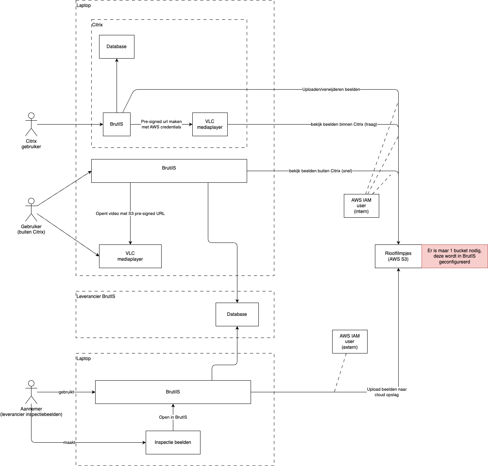

# Rioolfilmpjes

Beoogde oplossing door Gemeente Nijmegen mbt. rioolfilmpjes.

De leverancier heeft een demo gegeven van het opslaan van de filmpjes in AWS S3. Dit is zowel het openen van beeldmateriaal uit de S3 opslag als het beheren ervan (uploaden en verwijderen). Dit gebeurt op basis van inspecties (een set aan beeldmateriaal en metadata).
Wij kunnen zelf deze cloudopslag leveren (dit gebeurt nu ook voor geo).

In de afbeelding hieronder wordt weergegeven hoe dit er dan uit ziet. Hierin zijn drie verschillende flows te zien, deze worden hieronder verder uitgelegd.

### Flow 1: Via Citrix
De gebruiker gebruikt net als normaal BrutIS via Citrix. Omdat de Video's nu opgeslagen worden in AWS zullen zal de video niet van de gedeelde netwerkschijf worden gedownload maar vanuit AWS.
- De BrutIS configuratie is geconfigureerd met AWS IAM User credentials.
- De URL van de video in de S3 opslag moet pre-signed worden met de credentials. ([s3 pre-signed urls](https://docs.aws.amazon.com/AmazonS3/latest/userguide/using-presigned-url.html))
- Vervolgens kan de mediaplayer worden geopend met de pre-signed video url.

### Flow 2: Buiten Citrix
Omdat video streaming binnen Citrix niet de gewenste performance heeft, wordt het mogelijk om in de 2e flow buiten Citrix de videos terug te kijken.
De afdeling kan hier alleen met de leveranciers versie van de database werken.

### Flow 3: Aannemers leveren inspectie beelden
De aannameer kan inspectiebeelden direct in onze cloud opslag uploaden via hun BrutIS versie (let op, dit vergt het delen IAM user credentials met de leverancier).
De inspectie metadata komt dan in de database van de leverancier terecht, de afdeling kan dit synchroniseren met de database binnen Citrix.